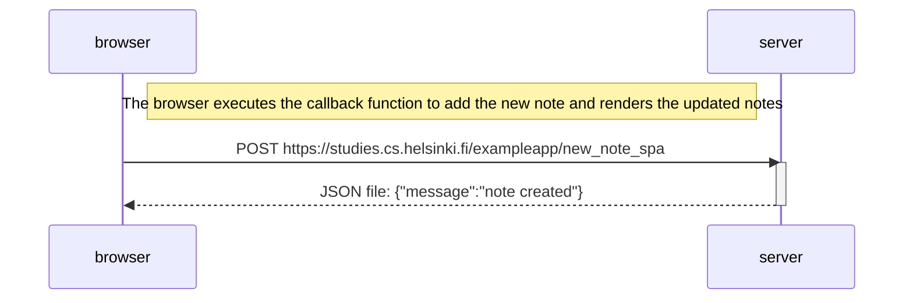

```mermaid
sequenceDiagram
    participant browser
    participant server

    Note right of browser: The browser executes the callback function to add the new note and renders the updated notes

    browser->>server: POST https://studies.cs.helsinki.fi/exampleapp/new_note_spa
    activate server
    server-->>browser: JSON file: {"message":"note created"}
    deactivate server
```
